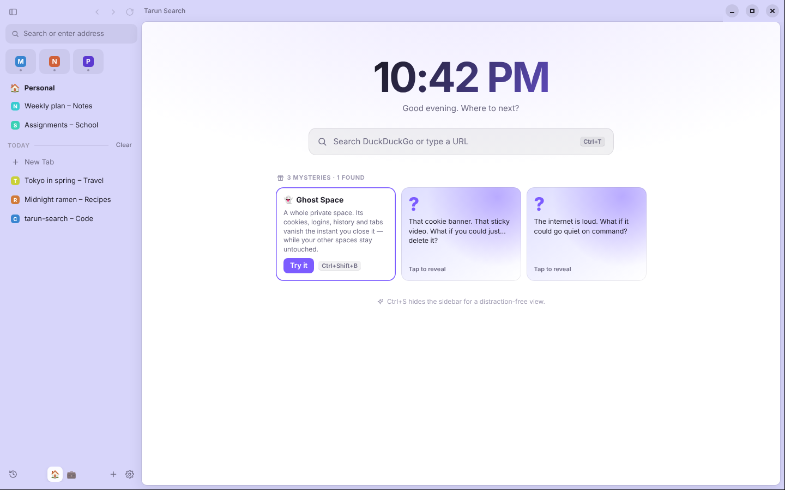

# Tarun Search

A calm, fast, private web browser in the style of Arc: your tabs live in a tidy sidebar, **spaces** keep different parts of your life apart, and a **command bar** puts everything one keystroke away.

It runs on macOS, Windows and Linux.



## Download and install

Get the installer for your computer from the **[Releases page](https://github.com/tarunyadgirkar/new11/releases/latest)**:

| Your computer | File to download | How to install |
| --- | --- | --- |
| **Mac** (Apple Silicon: M1–M4) | `Tarun-Search-…-mac-arm64.dmg` | Open it and drag **Tarun Search** into **Applications**. |
| **Mac** (Intel) | `Tarun-Search-…-mac-x64.dmg` | Same as above. |
| **Windows 10 / 11** | `Tarun-Search-…-win-x64.exe` | Double-click it. It installs and opens. No admin password needed. |
| **Linux** (any) | `Tarun-Search-…-linux-x86_64.AppImage` | Make it executable (`chmod +x`), then double-click it. |
| **Ubuntu / Debian** | `Tarun-Search-…-linux-amd64.deb` | `sudo apt install ./Tarun-Search-…-linux-amd64.deb` |

### The first time you open it

The installers are not signed with a paid Apple or Microsoft developer certificate, so your computer will ask you to confirm once:

- **Mac:** if you see *"Tarun Search can't be opened"*, open **System Settings → Privacy & Security**, scroll down and click **Open Anyway**. (On older macOS: right-click the app → **Open**.)
- **Windows:** if SmartScreen says *"Windows protected your PC"*, click **More info → Run anyway**.

After that it opens normally. To make it your default browser, open **Settings → General → Make default**.

## What you can do

| | |
| --- | --- |
| **Command bar** (`Ctrl/⌘ T`) | Type a website, a search, an open tab's name, something from your history — or a command like "split", "ghost" or "dark". |
| **Sidebar tabs** | Tabs stack vertically. Drag one up to **Pinned** (stays in this space) or **Favorites** (the icon grid, shared by every space). |
| **Spaces** | Separate sidebars for Personal, Work, School… each with its own colour and emoji. Switch at the bottom of the sidebar, with `Ctrl/⌘ Alt ← →`, or by swiping sideways on the sidebar. |
| **Split view** (`Ctrl/⌘ Shift E`) | Two pages side by side. |
| **Peek** | Shift-click a link (or open a link from a pinned tab) to preview it in a floating window. Close it, or keep it as a tab. |
| **Auto-archive** | Unpinned tabs you haven't touched for 12 hours tidy themselves into the **Archive**, where you can bring them back. You can change or turn this off in Settings. |
| **Sleeping tabs** | Idle tabs release their memory and wake up instantly when you click them. |
| **Hide the sidebar** (`Ctrl/⌘ S`) | Full-width browsing. Hover the left edge to peek at it. |
| Also | Find in page, zoom, downloads, history, reopen closed tab, right-click menus, spell check, light and dark themes. |

### 🎁 Three mystery features

Your home screen has three cards marked **?**. Click one to reveal it, or read the spoilers:

<details>
<summary>Spoilers</summary>

1. **👻 Ghost Space** (`Ctrl/⌘ Shift B`): a whole private space. It has its own cookies and logins, and leaves no history. Close it and everything in it is erased. Your normal spaces are never affected.
2. **⚡ Zap** (`Ctrl/⌘ Shift X`): click anything on a website (a cookie banner, a sticky video, a "subscribe!" box) to remove it. Tarun Search remembers, so it stays gone the next time you visit. Undo it from Settings → Mysteries.
3. **🧘 Focus Flow** (`Ctrl/⌘ Shift F`): a focus timer (15–90 min) that puts distracting sites like YouTube, Reddit and social feeds to sleep until you're done. A calm breathing screen appears instead. You choose the list.

</details>

## Privacy and security

- **Every website runs in a locked-down sandbox.** Sites get no access to your files, to Node.js, or to the browser's own controls. Each site is isolated from the others, and from the interface.
- **Tracker blocking** is on by default. It stops well-known ad and tracking scripts, and the shield in the address bar shows how many it blocked. Click the shield to pause it for one site.
- **HTTPS-First:** sites load over a secure connection whenever possible. You get a clear warning before an insecure one loads.
- **Pages with invalid security certificates are blocked**, with no "proceed anyway" button.
- **Camera, microphone, location, notifications and clipboard need your OK**, per site. You can reset them in Settings.
- **Downloads never open apps automatically.** Installers and scripts are only ever shown in their folder.
- **No accounts, no telemetry.** The only thing the browser contacts on its own is the GitHub Releases page, once at start-up, to see whether there's a new version. You can turn that off in Settings.
- **Hardened build.** Electron's security switches ("fuses") are locked in the shipped app. It can't be run as a plain Node.js process, debugging flags are ignored, the app code is integrity-checked, and cookies are encrypted with your OS keychain where one is available.

Keyboard shortcuts are listed in **Settings → Shortcuts**.

## Good to know

Tarun Search is built on Chromium (through Electron), so websites behave just as they do in Chrome. A few honest limits:

- **Netflix, Disney+ and Spotify's web player won't play.** They need Google's Widevine DRM module, which standard Electron doesn't include. YouTube and most other video sites work normally.
- **Chrome extensions aren't supported.** Ad and tracker blocking is built in instead.
- **Google sign-in** is sometimes refused in browsers Google doesn't recognise ("This browser may not be secure"). Tarun Search identifies itself as standard Chrome to avoid this. If it still happens, sign in once with a password or passkey on Google's page.
- **Updates:** the app tells you when a new version is out (Settings → About). Download the new installer and install it over the old one. Your tabs and settings are kept.

## For developers

```bash
cd tarun-search
npm ci              # installs Electron + build tools (no runtime dependencies)
npm start           # run the browser
npm test            # unit tests
npm run test:e2e    # end-to-end test of the real app (on Linux: xvfb-run -a npm run test:e2e)
npm run dist        # build installers for the current OS into dist/
```

**Releasing:** push a tag like `v1.0.1` (bump `version` in `package.json` first). The [GitHub Actions workflow](../.github/workflows/tarun-search.yml) tests the app, builds the macOS, Windows and Linux installers, and attaches them to a GitHub Release.

### How it's built

| File | Role |
| --- | --- |
| `src/main/main.js` | App start-up, process-wide hardening, the private `tarun://` scheme that serves the UI |
| `src/main/browser.js` | Spaces, tabs, split view, Peek, archive, history, permissions, downloads, the mysteries |
| `src/main/tab.js` | One website tab: a sandboxed `WebContentsView` |
| `src/main/sessions.js` | Permission prompts, tracker blocking, HTTPS-First, Focus Flow shield, downloads |
| `src/main/ipc.js` | The only door between the interface and the browser. Every message is checked. |
| `src/main/store.js` | Saves your spaces and settings. Atomic writes, validated on load, with a backup. |
| `src/main/url.js`, `shortcuts.js`, `trackers.js`, `zap.js`, `menus.js` | Address-bar logic, the shortcut table, the tracker list, the Zap picker, menus |
| `src/preload/ui-preload.js` | Gives the interface a tiny fixed API. Websites never get a preload. |
| `src/renderer/` | The interface: sidebar, command bar, settings, onboarding (plain HTML/CSS/JS, strict CSP) |
